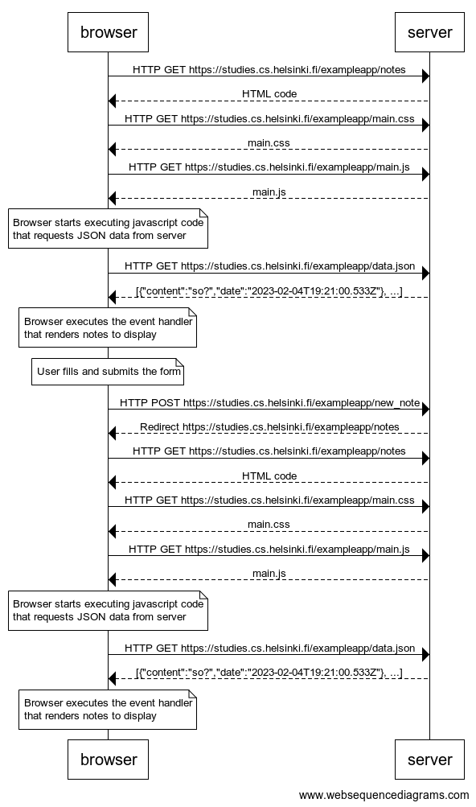

# 0.4: New note

browser->server: HTTP GET https://studies.cs.helsinki.fi/exampleapp/notes
server-->browser: HTML code
browser->server: HTTP GET https://studies.cs.helsinki.fi/exampleapp/main.css
server-->browser: main.css
browser->server: HTTP GET https://studies.cs.helsinki.fi/exampleapp/main.js
server-->browser: main.js

note over browser:
Browser starts executing javascript code
that requests JSON data from server 
end note

browser->server: HTTP GET https://studies.cs.helsinki.fi/exampleapp/data.json
server-->browser: [{"content":"so?","date":"2023-02-04T19:21:00.533Z"}, ...]

note over browser:
Browser executes the event handler
that renders notes to display
end note

note over browser:
User fills and submits the form
end note

browser->server: HTTP POST https://studies.cs.helsinki.fi/exampleapp/new_note
server-->browser: Redirect https://studies.cs.helsinki.fi/exampleapp/notes

browser->server: HTTP GET https://studies.cs.helsinki.fi/exampleapp/notes
server-->browser: HTML code
browser->server: HTTP GET https://studies.cs.helsinki.fi/exampleapp/main.css
server-->browser: main.css
browser->server: HTTP GET https://studies.cs.helsinki.fi/exampleapp/main.js
server-->browser: main.js

note over browser:
Browser starts executing javascript code
that requests JSON data from server 
end note

browser->server: HTTP GET https://studies.cs.helsinki.fi/exampleapp/data.json
server-->browser: [{"content":"so?","date":"2023-02-04T19:21:00.533Z"}, ...]

note over browser:
Browser executes the event handler
that renders notes to display
end note

## Sequence Diagram

