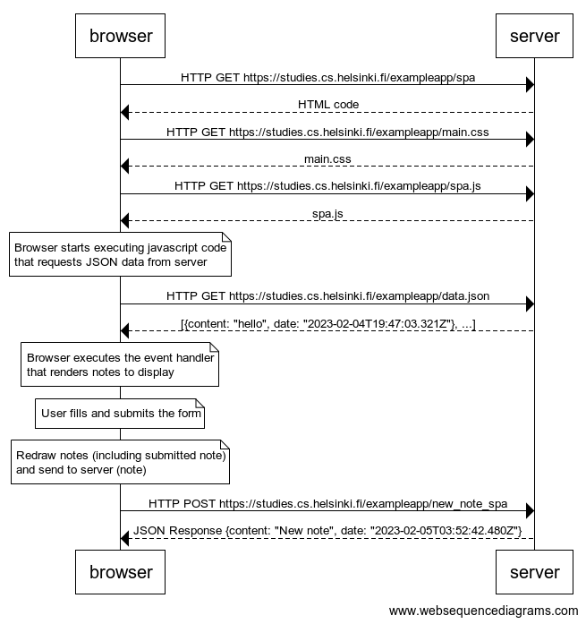

# 0.6: New note SPA

browser->server: HTTP GET https://studies.cs.helsinki.fi/exampleapp/spa
server-->browser: HTML code
browser->server: HTTP GET https://studies.cs.helsinki.fi/exampleapp/main.css
server-->browser: main.css
browser->server: HTTP GET https://studies.cs.helsinki.fi/exampleapp/spa.js
server-->browser: spa.js

note over browser:
Browser starts executing javascript code
that requests JSON data from server 
end note

browser->server: HTTP GET https://studies.cs.helsinki.fi/exampleapp/data.json
server-->browser: [{content: "hello", date: "2023-02-04T19:47:03.321Z"}, ...]

note over browser:
Browser executes the event handler
that renders notes to display
end note

note over browser:
User fills and submits the form
end note

note over browser:
Redraw notes (including submitted note)
and send to server (note)
end note

browser->server: HTTP POST https://studies.cs.helsinki.fi/exampleapp/new_note_spa
server-->browser: JSON Response {content: "New note", date: "2023-02-05T03:52:42.480Z"}

## Sequence Diagram

